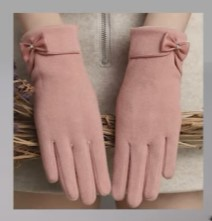
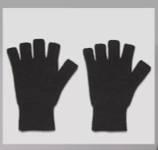
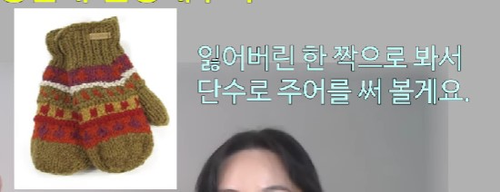
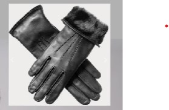
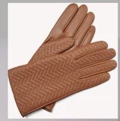

## 1. 분실물센터 찾기

- Do you know where the lost and found is?

- Can you tell me where the lost and found is?

- Where is the lost and found is?

## 2. 잃어버린 걸 표현

- I lost my glove.

    - My glove is missing (X)
        
        - 누가 훔쳐가거나 실수로 가져가거나 해서 없어진 것을 의미

- 장갑 
    - `glove` vs `mittens`

## 3. 확인 요청

- 장갑 분실물센터에 있는지 확인해주실래요?
    - Could you check if it's in the lost and found?

- 혹시 장갑 하나 못 보셨나요?
    - Have you seen a glove by any chance?
    - Did you happen to see a glove?

- 어떻게 생겼나요?
    - What does it look like?

        - How does it look?은 뭔가 아름다운 거를 만들어서 자랑할 때 씀 (의견을 물어보는 것)

## 4. 장갑 생김새 설명하기

- These are pink ladies gloves with a ribbon around the wrist.

- These are black wool fingerless gloves.

- It's a green wool mitten with a wintry pattern on the back.

- It's a black leather glove with fur around the wrist.

- It's a brown leather glove with zigzag patterns on the back.

## 5. 연락 부탁하기

- 혹시 찾게 되시면 연락 좀 주실 수 있을까요?

    - If you find it, could you text or call me?

- 제가 내일 다시 올게요

    - I'll check again tomorrow.
    