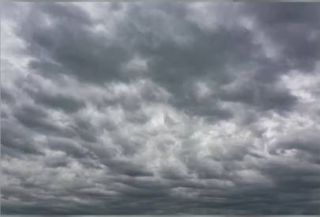
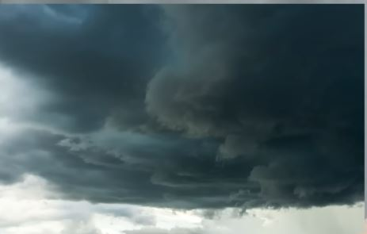

1. cloudy != 흐린

    - cloudy = 구름이 낀

    - sunny / cloudy / rainy / windy
        - ~y = ~가 가득한 / ~투성이의

2. 예문

    

    - It's cloudty today. Look at all the clouds in the blue sky.

    

    - Cloudy weather is good to take pictures.

3. 흐리다는 표현

    

    - overcast = 구름으로 뒤덮인, 흐린

    - It's overcast / gray / cloudy.

    

    - Rain clouds are gathering!

        - 비구름이 몰려오네!

    - Storm clouds are gathering!
        
        - 먹구름이 몰려오네!

4. 다른 구름에 관련된 표현

    

    - There are so many fluffy clouds!

        - 뭉게구름이 피었네.

    

    - It's a little cloudy. (=partly cloudy)

        - 구름이 조금 꼈네.

    

    - It's really cloudy. (= mostly cloudy)

        - 구름이 많이 꼈네.